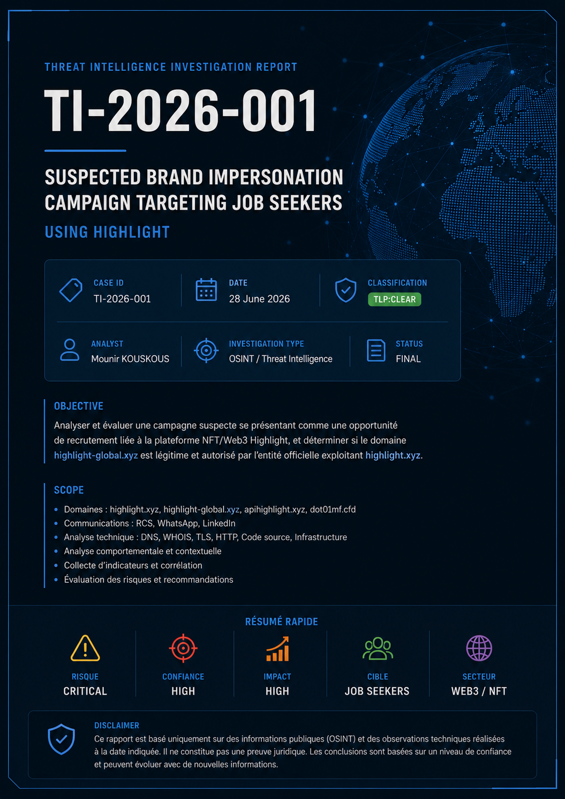

# Threat Intelligence Investigation



## Disclaimer

This repository documents an OSINT and Threat Intelligence investigation conducted using publicly available information and voluntary communications received by the analyst.

The report expresses analytical conclusions with confidence levels. It does not constitute a legal determination or a definitive attribution of fraud.

All observations are based on publicly observable evidence available at the time of the investigation. Personal information and case-specific identifiers have been redacted for ethical and privacy reasons.

## Objective

Investigate a suspected Web3/NFT recruitment campaign using the Highlight brand.

## Investigation

- Infrastructure comparison
- WHOIS / RDAP analysis
- DNS analysis
- TLS fingerprinting
- HTTP header analysis
- JavaScript static analysis
- MITRE ATT&CK mapping
- Diamond Model
- IOC extraction
- Risk assessment

## Main Report

- [Threat Intelligence Report - Markdown](report/Threat_Intelligence_Report.md)

## Executive Dashboard

| Element | Value |
|---|---|
| Case ID | `TI-2026-001` |
| Classification | `TLP:CLEAR` |
| Analyst | Mounir KOUSKOUS |
| Date | 28 June 2026 |
| Type | OSINT / Threat Intelligence |
| Risk | Critical |
| Confidence | High |
| Sector | Web3 / NFT |
| Target | Job seekers |

## Repository Structure

```text
OSINT-Web3-Fake-Recruitment-Investigation
|
|-- README.md
|-- report/
|   |-- Threat_Intelligence_Report.md
|-- timeline/
|   |-- timeline.png
|-- diagrams/
|   |-- infrastructure.drawio
|   |-- diamond-model.png
|   |-- attack-chain.png
|   |-- mitre-attack.png
|-- indicators/
|   |-- ioc.csv
|   |-- ioc.json
|   |-- ioc.md
|   |-- sigma/
|       |-- highlight_fake_recruitment.yml
|-- stix/
|   |-- indicators.json
|-- yara/
|   |-- highlight_fake_job.yar
|-- screenshots/
|-- annexes/
|-- LICENSE
```

## Technologies

- OSINT
- WHOIS / RDAP
- DNS
- TLS
- HTTP
- JavaScript
- MITRE ATT&CK
- Diamond Model
- Threat Intelligence

## Skills Demonstrated

- Threat Intelligence
- OSINT
- Infrastructure Analysis
- JavaScript Static Analysis
- DNS Analysis
- WHOIS Investigation
- HTTP Analysis
- IOC Extraction
- MITRE ATT&CK Mapping
- Risk Assessment
- Incident Documentation

## Ethical Redactions

The public version redacts:

- Phone numbers
- Case-specific referral code
- Private identifiers from screenshots or conversations
- Any personal data not required for technical analysis

Domains and public infrastructure are retained as factual observables within the context of the investigation.
